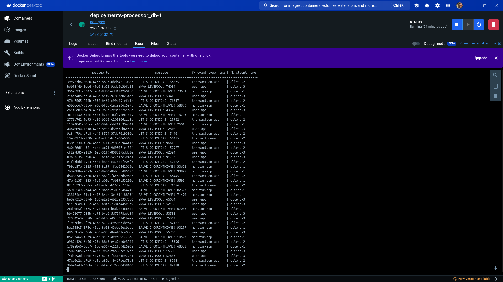
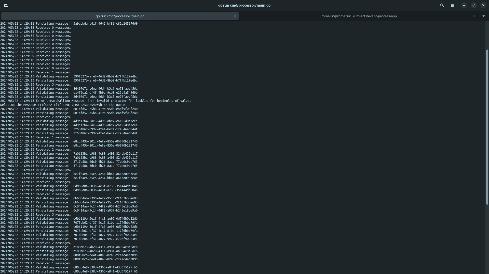

# Event Process App

Este projeto visa a criação de um `event processor` que garanta o processamento de todos os **eventos** criados por aplicações produtoras. O processamento feito por este event processor consiste em receber, validar e salvar os eventos para serem entregues aos devidos destinatários. A responsabilidade de entregar as mensagens aos destinatários é de outro componente, `sender`, que poderá ser desenvolvido no futuro.

Este projeto disponibiliza `fake producers` presentes em `cmd/producers/main.go`. O objetivo desses fake producers é validar a implementação do event processor.

## Requisitos

Os requisitos a serem atingidos pelo `event processor` são os seguintes:

1. Suportar `multi-tenant`, servindo para diferentes produtores, eventos e clientes;
1. `Resiliência`, sem perder nenhum evento gerado;
1. `Disponibilidade`, sempre online para processar os eventos;
1. `Validação` do payload/eventos recebidos;

## Infraestrutura

Este projeto utiliza o [Amazon SQS](https://aws.amazon.com/pt/sqs/) como message broker, "escutando" toda nova mensagem entregue na `file/queue`. Os fake producers se conectam ao SQS para registrar novos eventos.

Para a persistência das mensagens para serem posteriormente entregues aos clientes destinatários, é utilizado um banco de dados [PostgreSQL](https://www.postgresql.org/).

## Execução

Para executar localmente o projeto, todos os componentes listados na seção de infraestrutura podem ser criados utilizando [Docker Containers](https://www.docker.com/). Após instalado, é possível utilizar o docker compose presente em `deployments/docker-compose.yaml`, executando o comando abaixo.

```bash
docker compose -f deployments/docker-compose.yaml up
```

Outra alternativa é a instalação e execução do PostgreSQL e Amazon SQS localmente. Entretanto, para o caso do SQS, é recomendado a utilização do [LocalStack](https://github.com/localstack/localstack) para simular o serviço localmente.

Independente de qual forma escolher, é necessário criar um novo arquivo `.env` na pasta raiz do projeto e colocar as credenciais e configurações necessárias para executar o projeto. É possível utilizar o arquivo `.env-template` como referência de quais variáveis de ambiente você precisa adicionar. Para carregar as variáveis de ambiente, execute para cada novo terminal o seguinte comando, em máquinas Linux:

```bash
source .env
```

Para `executar o event processor`, basta executar o seguinte comando:

```bash
go run cmd/processor/main.go
```

Após executar o comando, será possível ver que a aplicação está rodando e "escutando" por novas mensagens. Para enviar novas mensagens ao SQS para serem processadas pelo event processor, é possível executar os `fake producers` utilizando o comando abaixo:

```bash
go run cmd/producers/main.go
```

**Sinta-se livre para alterar os dados, informações, intervalo de tempo, etc., presentes no producers. O objetivo desse arquivo é apenas gerar mensagens para validação do event processor.**

Outra forma é utilizar o [CLI awslocal](https://github.com/localstack/awscli-local) caso tenha instalado localmente. O comando abaixo é um exemplo de como enviar uma mensagem utilizando o awslocal, sendo necessário substituir apenas a URL pela URL correta da queue configurada no `.env`:

```bash
awslocal sqs send-message --queue-url http://sqs.us-east-1.localhost.localstack.cloud:4566/000000000000/SQS_QUEUE --message-body "Hello World"
```

Uma vez que tenha mensagens enviadas ao Amazon SQS, é possível ver os logs do `event processor` processando as mensagens.

## Validação

A forma mais simples de validação é `analisar os logs` da aplicação. Entretanto, a melhor forma para comprovar a persistência de mensagens corretas é acessar o banco de dados e verificar as mensagens salvas.

Se o banco de dados PostgreSQL está sendo executado localmente, basta acessar e executar:

```sql
SELECT count(*) FROM message;
```

Caso o banco de dados esteja em um container, é possível acessar o container e executar a mesma query acima. Para acessar o container, utilize o seguinte comando:

```bash
docker exec -it [CONTAINER ID] psql -U [DB USER] -W [DATABASE NAME]
```

Em caso de dúvidas ou complicações, leia e siga os passos deste post do [StackOverflow](https://stackoverflow.com/questions/37099564/docker-how-can-run-the-psql-command-in-the-postgres-container).

### Images





### Testes

É possível executar testes no projeto para validação dos comportamentos dos componentes. É necessário fornecer um banco de dados PostgreSQL para a realização dos testes, passando as informações para as variáveis de ambiente `DB_DRIVER_TEST` e `DB_CONNECTION_TEST`. Para executar os testes, utilize os seguintes comandos:

```bash
# Execução simples
$ go test ./...
# Cobertura dos Testes
$ go test ./... -coverprofile=coverage.out
# Benchmarking
$ go test ./... -bench=.
```

## Considerações

A decisão de se utilizar o Amazon SQS foi baseada pela sua capacidade de escalar, reter e gerenciar mensagens, além de estar disponível gratuitamente no LocalStack. O vídeo [AWS SQS Overview For Beginners](https://www.youtube.com/watch?v=CyYZ3adwboc) foi fundamental para dar embasamento na escolha.

Para a persistência foi escolhido um banco de dados SQL para garantir validações utilizando constraints como primary keys únicas e foreign keys. Com isso, podemos garantir a persistência de mensagens não duplicadas e com clientes e eventos existentes dentro do ecossistema da aplicação.

### Tempo de Desenvolvimento

Para a realização deste projeto, foi disponibilizado algo próximo de 8 horas ao longo de 6 dias.
